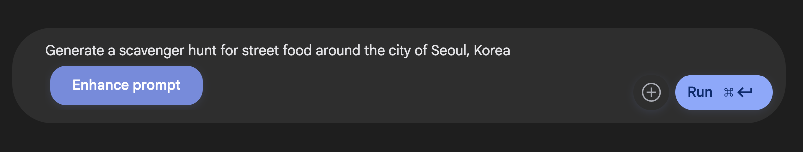

# Gemini Prompt Enhancer Chrome Extension

A modern, minimal Chrome extension to instantly enhance your prompts for Large Language Models (LLMs) using the **Gemini API**. Features a beautiful glassmorphism UI, minimal icon-based design, and seamless integration with your favorite chat platforms.

---

## ✨ Features
- **Prompt Enhancement:** Instantly rephrase and improve your prompts using Gemini AI.
- **Modern UI:** Minimal, glassmorphic popup and button for a clean, elegant experience.
- **Easy Setup:** Securely store your Gemini API key in one click.
- **Seamless Integration:** Works on all major chat and AI platforms.
- **RTL/LTR Support:** Automatically adjusts text direction for different languages.

---

## 📸 Screenshot



---

## 🚀 Installation
1. **Clone or Download:**
   - Download this repository as a ZIP and extract it, or clone it via Git:
     ```sh
     git clone https://github.com/mxyxyz9/LLM-Prompt-Enhancer-main.git
     ```
2. **Load in Chrome:**
   - Go to `chrome://extensions/`
   - Enable **Developer mode** (top right)
   - Click **Load unpacked**
   - Select the extracted folder

---

## 🛠️ Usage
1. **Set Your Gemini API Key:**
   - Click the extension icon in your browser.
   - Enter your Gemini API key in the popup and save.
2. **Enhance Prompts:**
   - On supported sites, look for the ✨ Enhance Prompt button next to textareas.
   - Write your prompt, click the button, and get an improved version instantly.

---

## 🧑‍💻 Developer Notes
- Built with vanilla JS, HTML, and CSS (glassmorphism, minimal icons, and best practices).
- All API calls are made securely from your browser.
- No data is ever sent to third parties except Gemini API.

---

## 🤝 Connect with Me
- **GitHub:** [@mxyxyz9](https://github.com/mxyxyz9/)

> _“Building things that matter — always in dark mode.”_

---

## 📄 License
MIT License


